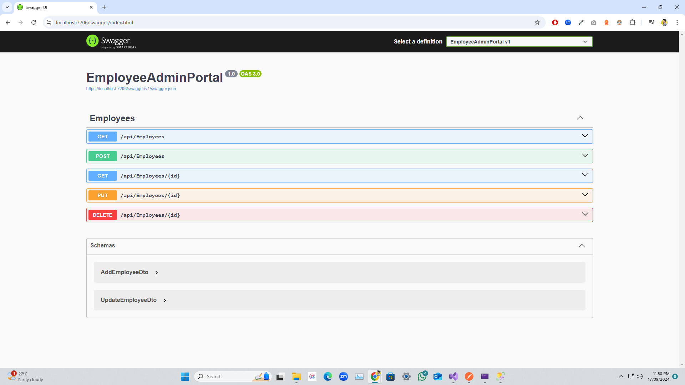
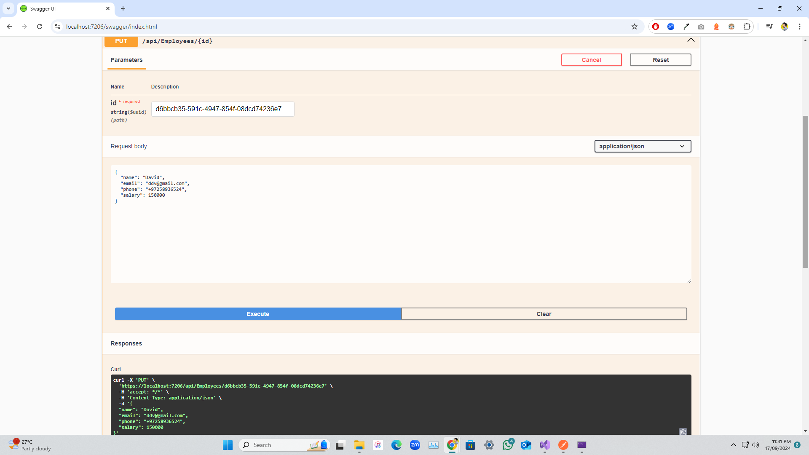
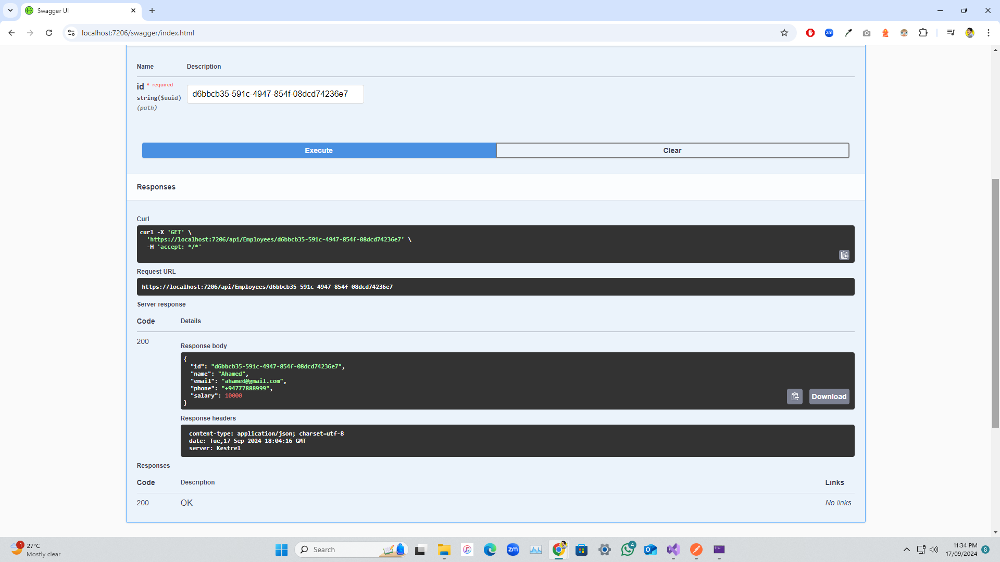
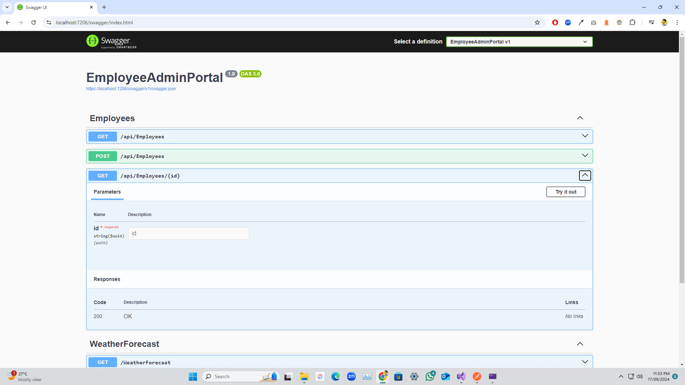
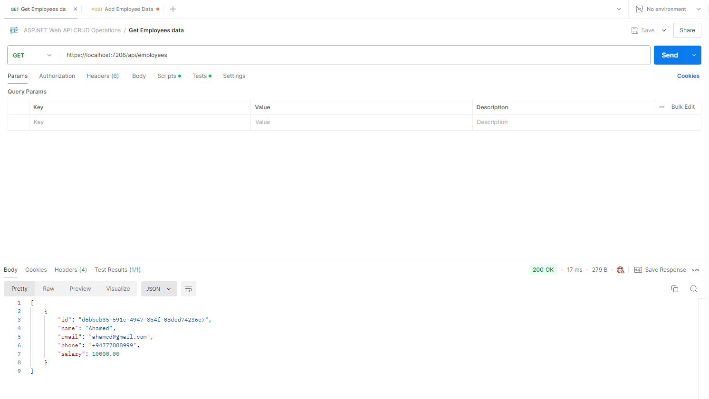
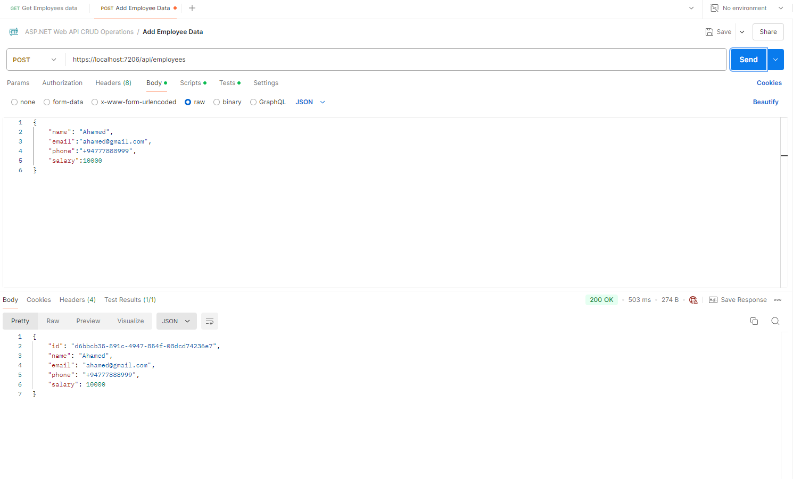

# ASP.NET Web API CRUD Operations

Welcome to the ASP.NET Web API CRUD Operations project! This repository showcases a RESTful API for performing Create, Read, Update, and Delete (CRUD) operations using ASP.NET Core, built with clean and efficient code to manage data effectively. Perfect for understanding the foundations of building a full-fledged Web API in ASP.NET.

---

## 📝 Table of Contents

- [About the Project](#about-the-project)
- [Features](#features)
- [Getting Started](#getting-started)
  - [Prerequisites](#prerequisites)
  - [Installation](#installation)
  - [Running the API](#running-the-api)
- [API Endpoints](#api-endpoints)
- [Project Structure](#project-structure)
- [Technologies Used](#technologies-used)
- [Contributing](#contributing)
- [License](#license)
- [Contact](#contact)

---

## 🌟 About the Project

This project demonstrates a RESTful API implementation using ASP.NET Core for managing data. It’s a simple, clean architecture setup that supports CRUD operations for an example entity. This project is designed for developers who want to learn or showcase foundational API skills in ASP.NET.

---

## 🚀 Features

- **CRUD Operations**: Full support for Create, Read, Update, and Delete actions.
- **RESTful Standards**: Follows REST principles to enhance scalability and performance.
- **Clean Architecture**: Separation of concerns and modular design.
- **Error Handling**: Built-in error handling for API responses.
- **Data Validation**: Validation for data integrity.

---

## 🛠️ Getting Started

### Prerequisites

- **.NET SDK 6.0+** installed
- **MSSQL Server** (for database support)

### Installation

1. **Clone the Repository**
   ```bash
   git clone https://github.com/arshadahamed/ASP.NET-Web-API-CRUD-Operations.git
   cd ASP.NET-Web-API-CRUD-Operations

# SCREEN SHOOTS







